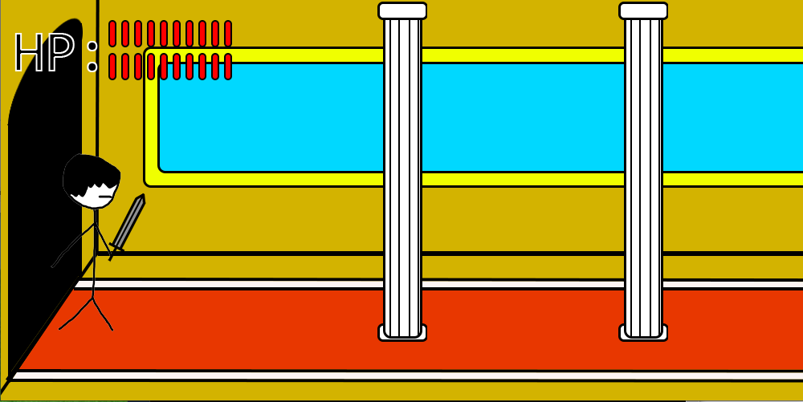

## Lord of Edge

Lord of Edge is a short side scrolling action game designed in Processing 3.3.

>This story is set in the year 1xxx, in the small medieval village of Villageville. You play the role of Lord Edge, a famous knight who had sworn off his sword long ago for reasons known only to him. Life in the village was peaceful, however disaster struck when the evil criminal Masked Moustache Man invades the village and lays waste to everything in sight. As the only knight in the area, Lord Edge takes it upon himself to deliver justice to this villain.

